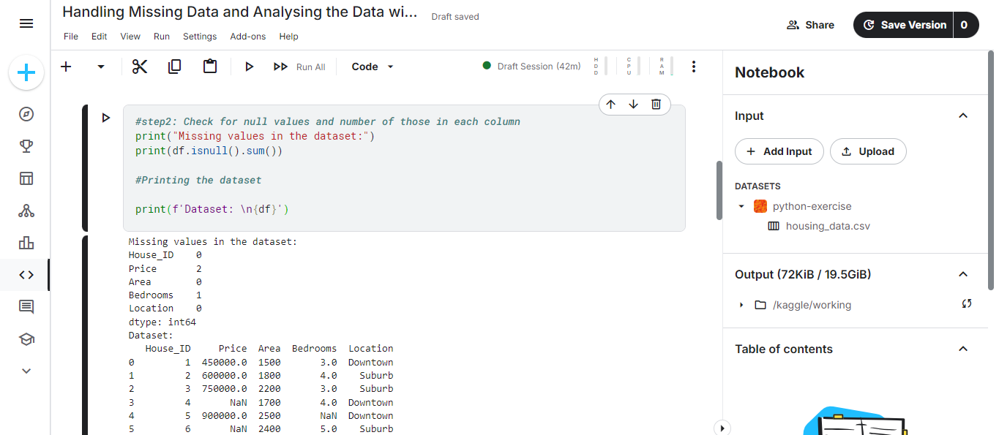
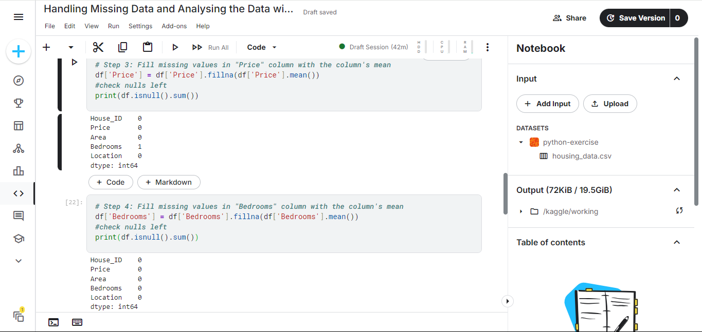
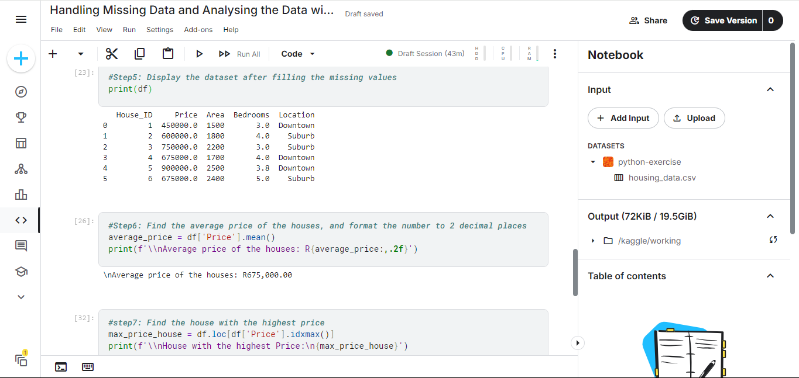
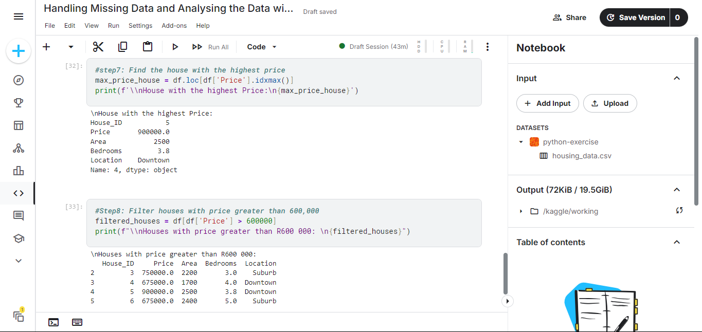

# Handling Missing Data and Analyzing Data with Python 📊

Welcome to my project on **Handling Missing Data and Analyzing Data with Python**! This repository showcases my ability to clean and analyze a housing dataset using **Python** and **Pandas** on Kaggle. It highlights key data preprocessing techniques and statistical analysis, turning raw data into actionable insights for real estate applications. 🚀

## 📋 Table of Contents
- [Overview](#overview)
- [Tools](#tools)
- [Objectives](#objectives)
- [Results & Insights](#results--insights)
- [Skills Demonstrated](#skills-demonstrated)
- [Screenshots](#screenshots)
- [Files](#files)
- [Project Details](#project-details)
- [Contact](#contact)

## 🌟 Overview
This project demonstrates a practical approach to handling missing data and performing analysis on a housing dataset using Kaggle’s web-based notebook environment. By loading the dataset, managing missing values, and extracting insights like average prices and price extremes, it serves as a foundation for real estate market analysis and decision-making. 🌍

## 🛠️ Tools
- **Programming**: Python
- **Libraries**: Pandas
- **Platform**: Kaggle (Web-based Notebook Environment)

## 🎯 Objectives
- Load and inspect a housing dataset
- Identify and handle missing values
- Verify the effectiveness of missing data handling
- Analyze data to extract insights (e.g., average price, price extremes, filtered houses)

## 📊 Results & Insights
- 🔍 **Missing Values**: Filled missing 'Price' and 'Bedrooms' values with column means.
- ✅ **Verification**: Confirmed no remaining missing values post-processing.
- 📈 **Analysis**:
  - Calculated the average house price.
  - Identified the highest and lowest priced houses.
  - Filtered houses exceeding $600,000.
- 💡 **Business Impact**: Provides a basis for pricing strategies and property evaluations in the real estate market.

## 🧠 Skills Demonstrated
- Data loading and inspection
- Missing value handling
- Data verification
- Statistical analysis (mean, min, max)
- Data filtering and interpretation

## 📸 Screenshots
Visualize the analysis process with these Kaggle notebook screenshots:

- 
- 
- 
- 

## 📂 Files
| File Name             | Description                                     |
|-----------------------|-------------------------------------------------|
| `housing_data.csv`    | Housing dataset with Price, Bedrooms, etc.      |
| `kaggle_notebook.ipynb` | Kaggle notebook with Python code and results    |
| `Screenshot1.png`     | Screenshot of analysis step 1                   |
| `Screenshot2.png`     | Screenshot of analysis step 2                   |
| `Screenshot3.png`     | Screenshot of analysis step 3                   |
| `Screenshot4.png`     | Screenshot of analysis step 4                   |
| `README.md`           | Project documentation                           |

## 📋 Project Details
- **Type**: Individual Exercise
- **Dataset**: `housing_data.csv`
- **Tech Stack**: Python, Pandas, Kaggle
- **Topic**: Housing Data Analysis
- **Duration**: ~20 minutes

This project reflects my expertise in data cleaning and analysis, contributing to my broader data analytics journey.

> 💡 Explore more projects in my [main portfolio](https://github.com/Lehlohonolo-Saohatse/data-analytics-portfolio)
