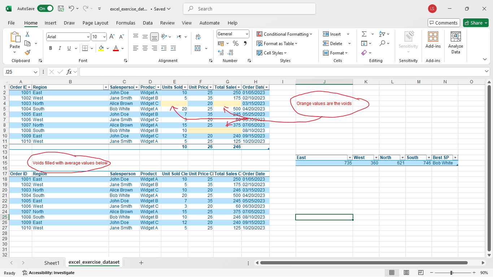

# 📊 Sales Data Analysis with Excel

## 📌 Overview
This project demonstrates my ability to clean and analyze a sales dataset using **Microsoft Excel**. It showcases essential data analytics tasks such as handling missing values, analyzing regional performance, and generating summary reports using Pivot Tables. This is a foundational yet powerful example of spreadsheet-based business analytics.

---

## 🛠 Tools Used
- Microsoft Excel
- Conditional Formatting
- Basic formulas (`AVERAGE`, `IF`, `INDEX`, `MATCH`)
- Pivot Tables

---

## 🎯 Key Objectives
- Clean and standardize raw sales data
- Identify and handle missing values using calculated averages
- Recalculate total sales values
- Analyze sales performance by region
- Identify the best-performing salesperson
- Summarize key insights using Pivot Tables

---

## 📈 Results & Insights

- 🔍 **Voids Detected**: Missing values in *Units Sold* and *Unit Price* were identified and filled using column averages.
- 🔁 **Sales Recalculated**: Total Sales were recalculated for rows with missing or derived values using `Units Sold × Unit Price`.
- 📊 **Pivot Table Insights**:
  - **Total Units Sold per Region**:
    - East: 735
    - West: 360
    - North: 621
    - South: 746
  - **Best Salesperson**: Bob White (Highest total units sold)
- 📌 **Business Impact**: This analysis shows how Excel can be used to quickly identify trends and outliers in sales performance across regions and individuals.

---

## 🧠 Skills Demonstrated
- Data Cleaning & Preparation
- Missing Value Imputation
- Logical & Statistical Formula Application
- Region-Based Aggregation
- Pivot Table Design & Reporting
- Sales Performance Interpretation

---

## 📸 Project Screenshot

---

## 📂 Files Included

| File Name             | Description                                     |
|----------------------|-------------------------------------------------|
| `cleaned_dataset.xlsx` | Cleaned and analyzed dataset with formulas applied |
| `screenshot.png`      | Image of the completed Excel workbook/dashboard |
| `README.md`           | Project documentation and summary              |

---

## 🗂 Project Details

- **Project Type**: Individual Exercise
- **Dataset**: Manually created / Provided for practice
- **Tech Stack**: Microsoft Excel
- **Topic**: Sales & Performance Analytics
- **Duration**: ~ 15 min

---

## 🙋 About Me

I'm **Lehlohonolo Saohatse**, a multidisciplinary technologist with a strong passion for data analysis, software engineering, and business intelligence. This project reflects my early proficiency with Excel as a tool to deliver meaningful business insights.

---

📫 **Connect With Me**:  
[LinkedIn](https://www.linkedin.com/in/lehlohonolo-saohatse-ab6ab624b/) • [GitHub](https://github.com/Lehlohonolo-Saohatse) • [Email](https://message-ls.streamlit.app/)

> 💡 Explore more projects in my [main portfolio](https://github.com/Lehlohonolo-Saohatse/lehlohonolo-data-portfolio)
