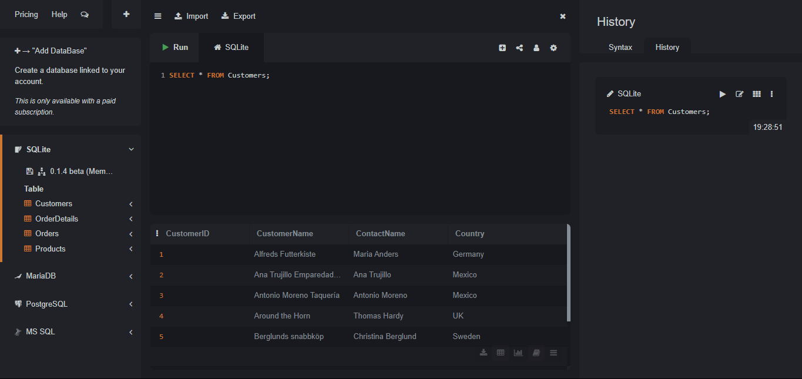
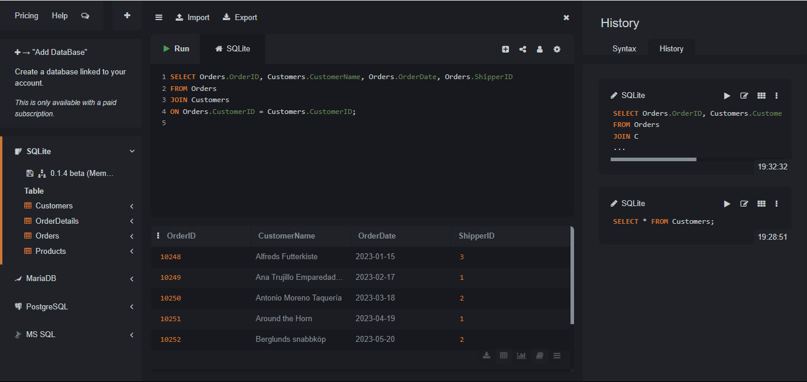
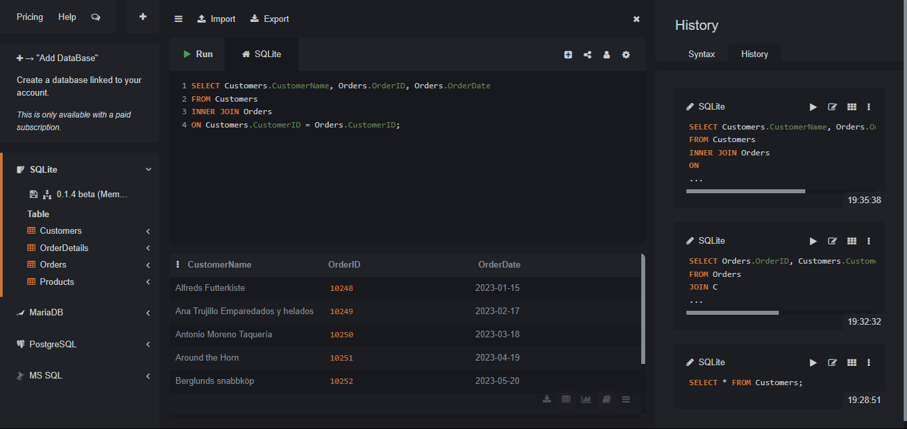
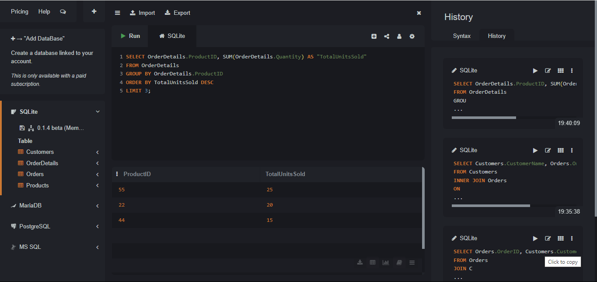

# Retrieve and Analyze Customer and Order Data with SQLite 📊

Welcome to my **Retrieve and Analyze Customer and Order Data with SQLite** project! This repository showcases my ability to leverage **SQLite**, a lightweight relational database, to retrieve and analyze customer and order data. Using advanced SQL techniques like joins, grouping, and subqueries, this project delivers actionable insights from a sample dataset—perfect for mastering database analytics. 🚀

## 📋 Table of Contents
- [Overview](#overview)
- [Tools](#tools)
- [Objectives](#objectives)
- [Results & Insights](#results--insights)
- [Skills Demonstrated](#skills-demonstrated)
- [Screenshots](#screenshots)
- [Files](#files)
- [Project Details](#project-details)
- [About Me](#about-me)
- [Contact](#contact)

## 🌟 Overview
This project demonstrates a practical application of SQLite to analyze customer and order data, focusing on data retrieval, table joins, and advanced querying. By identifying top-selling products and recent customer activity, it provides a solid foundation for business intelligence and database-driven decision-making. 📈

## 🛠️ Tools
- **Database**: SQLite
- **Query Techniques**: JOIN, GROUP BY, SUBQUERIES
- **Platform**: SQLite Online Editor

## 🎯 Objectives
- Retrieve detailed customer and order information
- Perform joins to combine related tables
- Identify top-selling products using GROUP BY and HAVING
- Filter data with subqueries to find recent customer activity

## 📊 Results & Insights
- 🔍 **Data Retrieved**: Successfully fetched customer names, order IDs, and dates from joined tables.
- 📋 **Top Products**: Identified top-selling products using GROUP BY and ORDER BY (e.g., ProductID 55 with 25 units).
- ⏳ **Recent Activity**: Subquery highlighted customers with orders in the last 18 months from July 20, 2025.
- 💡 **Business Impact**: Demonstrates SQLite’s efficiency for analyzing small to medium-sized datasets, supporting business insights.

## 🧠 Skills Demonstrated
- Data retrieval and querying
- Table joins (INNER JOIN)
- Grouping and aggregation
- Subquery implementation
- Database analysis and interpretation

## 📸 Screenshots
Explore the analysis process with these SQLite query result screenshots:

- 
- 
- 
- 

## 📂 Files
| File Name             | Description                                     |
|-----------------------|-------------------------------------------------|
| `Customers.csv`       | Customer data (CustomerID, CustomerName, ContactName, Country) |
| `Orders.csv`          | Order data (OrderID, CustomerID, OrderDate, ShipperID) |
| `OrderDetails.csv`    | Order details (OrderID, ProductID, Quantity)    |
| `Products.csv`        | Product data (ProductID and related details)    |
| `Screenshot1.png`     | Screenshot of query results 1                   |
| `Screenshot2.png`     | Screenshot of query results 2                   |
| `Screenshot3.png`     | Screenshot of query results 3                   |
| `Screenshot4.png`     | Screenshot of query results 4                   |
| `README.md`           | Project documentation                           |

## 📋 Project Details
- **Type**: Individual Exercise
- **Dataset**: Provided CSV files (Customers.csv, Orders.csv, OrderDetails.csv, Products.csv)
- **Tech Stack**: SQLite
- **Topic**: Customer & Order Analytics
- **Duration**: ~20 minutes

> 💡 Explore more projects in my [main portfolio](https://github.com/Lehlohonolo-Saohatse/data-analytics-portfolio)
